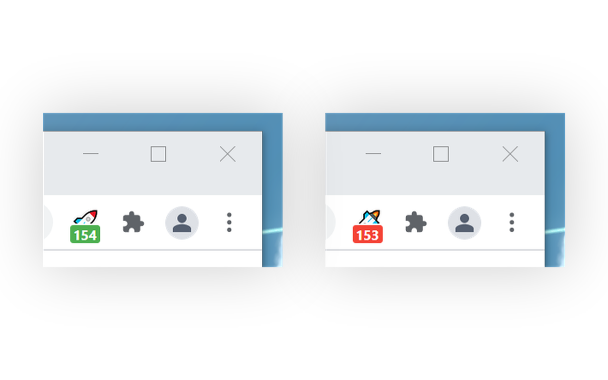

# GME to the moon

<table>
	<tr>
		<th>Chrome</th>
		<th>Firefox</th>
	</tr>
	<tr>
		<td>
			
			<br />
			<i>Available soon...</i>
		</td>
		<td>
			
			<br />
			<a
				href="https://addons.mozilla.org/en-US/firefox/addon/gme-to-the-moon/"
			>
				https://addons.mozilla.org/en-US/firefox/addon/gme-to-the-moon/
			</a>
		</td>
	</tr>
</table>

## Develop

```
yarn
yarn start
```

-   Use [Debugger for Firefox](https://marketplace.visualstudio.com/items?itemName=firefox-devtools.vscode-firefox-debug) with VS Code and Run and Debug

-   Use [Debugger for Chrome](https://marketplace.visualstudio.com/items?itemName=msjsdiag.debugger-for-chrome) with VS Code and Run and Debug. Note that you need to refresh and see logs (background page) in `chrome://extensions` instead

## Build

```
yarn
yarn build
yarn package
```
